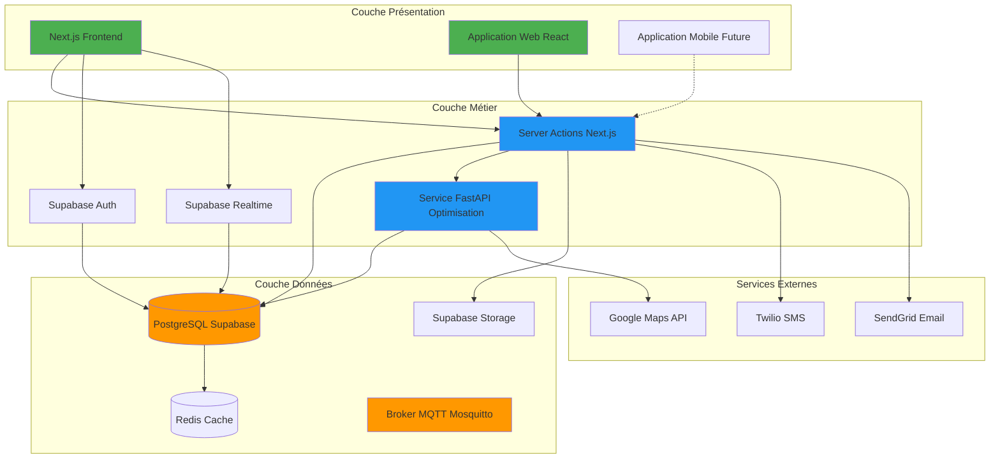
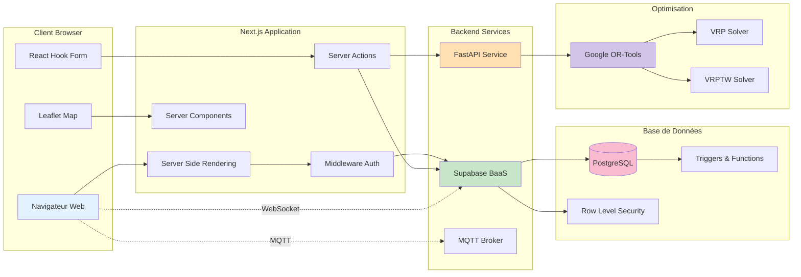
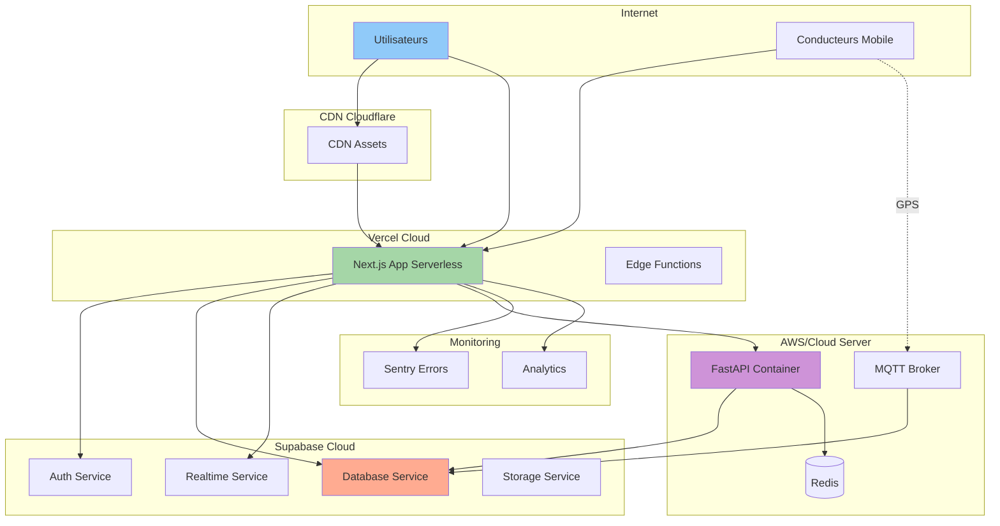
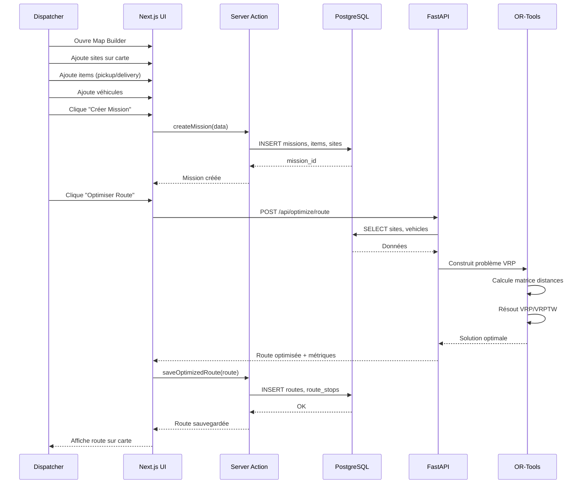
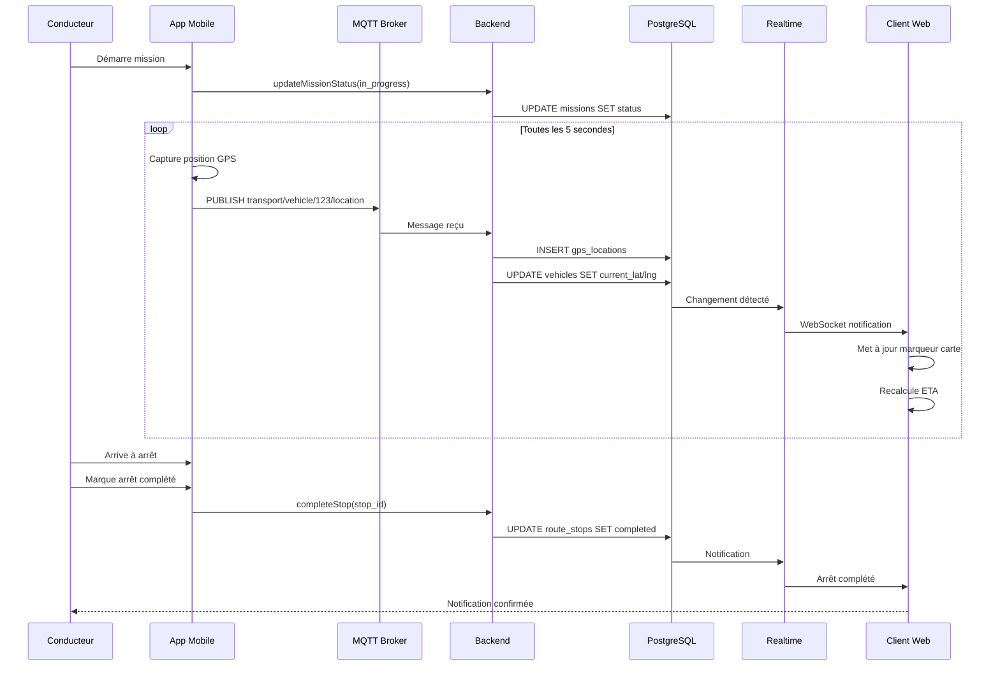
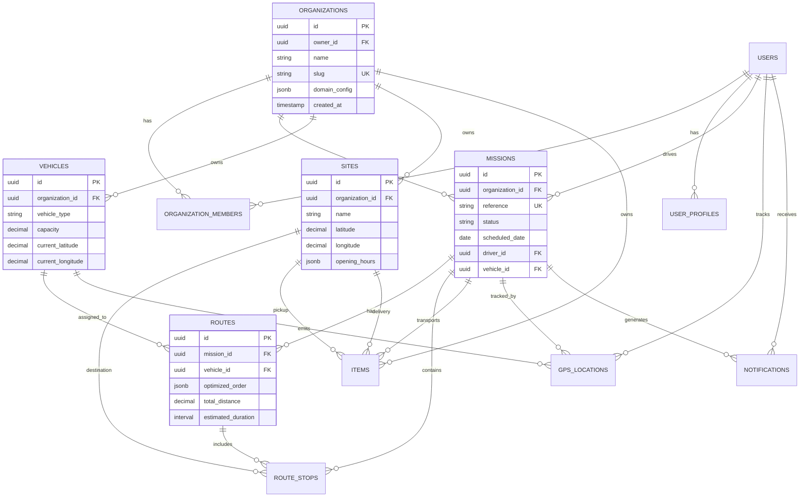
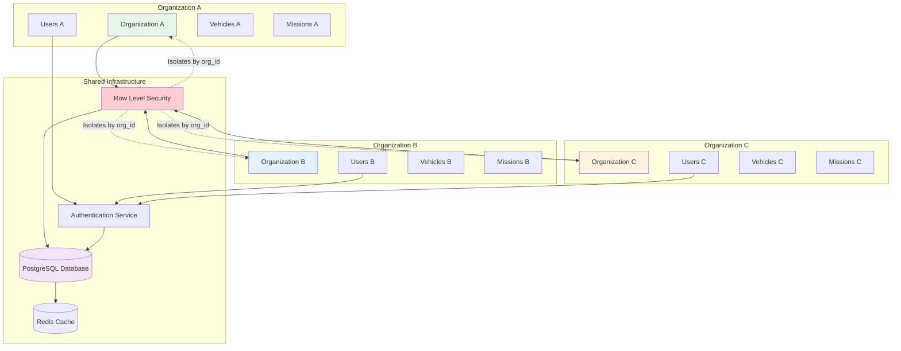
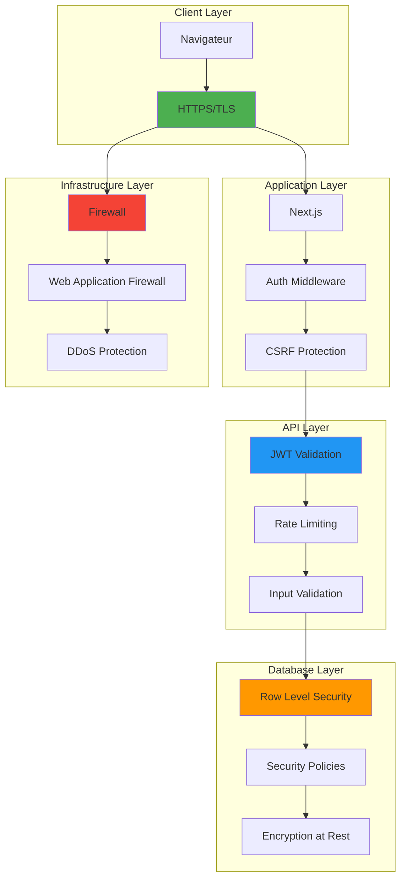
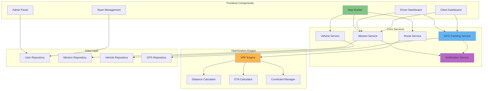

# Architecture Globale du Système

## 1. Architecture en Couches

## 2. Architecture Technique Détaillée

## 3. Architecture de Déploiement

## 4. Flux de Données - Création de Mission

## 5. Flux de Données - Suivi GPS Temps Réel

## 6. Modèle de Données - Relations Principales

## 7. Architecture Multi-Tenant

## 8. Pipeline CI/CD

```mermaid
graph LR
    subgraph "Développement"
        DEV[Développeur]
        GIT[Git Commit]
    end

    subgraph "GitHub Actions"
        LINT[ESLint]
        TYPE[TypeScript Check]
        TEST[Tests Unitaires]
        BUILD[Build]
    end

    subgraph "Staging"
        STAGE_DEPLOY[Deploy Staging]
        E2E[Tests E2E]
        VALIDATE[Validation Manuelle]
    end

    subgraph "Production"
        PROD_BUILD[Build Production]
        DOCKER[Docker Images]
        DEPLOY[Deploy Production]
    end

    DEV --> GIT
    GIT --> LINT
    LINT --> TYPE
    TYPE --> TEST
    TEST --> BUILD

    BUILD --> STAGE_DEPLOY
    STAGE_DEPLOY --> E2E
    E2E --> VALIDATE

    VALIDATE -->|Approve| PROD_BUILD
    PROD_BUILD --> DOCKER
    DOCKER --> DEPLOY

    VALIDATE -->|Reject| DEV

    style GIT fill:#4CAF50
    style BUILD fill:#2196F3
    style DEPLOY fill:#FF5722
```

## 9. Architecture de Sécurité

## 10. Composants du Système

## Légende

- **Rectangles** : Composants/Services
- **Cylindres** : Bases de données
- **Flèches pleines** : Communication synchrone
- **Flèches pointillées** : Communication asynchrone
- **Couleurs** :
  - Vert : Couche présentation
  - Bleu : Couche métier
  - Orange : Couche données
  - Violet : Services externes
